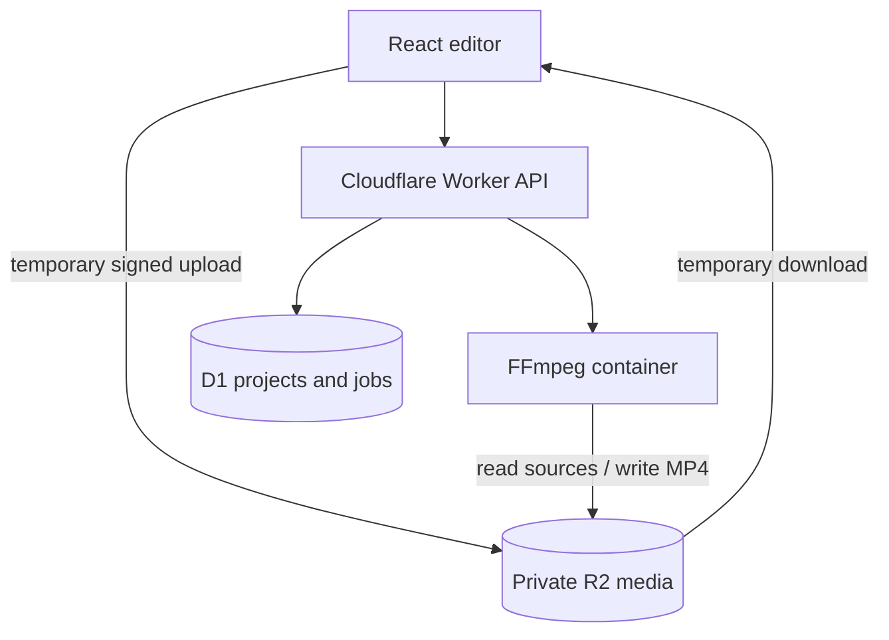

# QuickStory

QuickStory is a fast, template-first social video maker. Choose a look, add photos and video clips, accept the automatic edit or fine-tune individual clips, and export a real MP4.

The product deliberately opens in the editor. There is no dashboard, approval process, or required multi-step wizard.

## Included in the first release

- Six distinct recap, slideshow, promo, memory, graphic, and clean templates
- Drag-and-drop photo and video uploads
- Automatic template timing and clip arrangement
- Reorderable visual timeline
- Live 9:16, 1:1, and 16:9 previews
- Headline, subtitle, and accent color controls
- Optional per-clip trim, speed, duration, crop, position, zoom, rotation, color, volume, and text controls
- On-device autosave using IndexedDB, including source media
- Private multipart uploads to Cloudflare R2 through authenticated Worker routes
- Cloudflare D1 project and render history
- Server-rendered H.264/AAC MP4 output through FFmpeg in a Cloudflare Container
- Installable PWA metadata

## Architecture



GitHub holds the complete source. Cloudflare Workers serves the Vite application and API. Source and output media stay in a private R2 bucket. D1 stores project JSON and render history. A scale-to-zero Cloudflare Container runs FFmpeg for consistent MP4 output across desktop and mobile browsers.

## Local editor development

```bash
npm install
npm run dev
```

The editor runs without Cloudflare for UI work. Export requires the Worker, R2, D1, and the renderer container.

## Cloudflare setup

Cloudflare Containers require the Workers Paid plan.

1. Run `npm run cf:setup`.
2. Copy the D1 ID printed by Wrangler into `wrangler.jsonc` in place of the all-zero placeholder ID.
3. Apply the database migration:

```bash
npx wrangler d1 migrations apply quickstory-db --remote
```

4. Build and deploy:

```bash
npm run deploy
```

For the first private release, protect the deployed application with Cloudflare Access or an equivalent access rule. This prevents anonymous visitors from consuming upload and rendering capacity while preserving the one-screen editor after sign-in.

## Verification

```bash
npm run typecheck
npm test
npm run build
node --check render-service/server.mjs
```

## Deliberate first-release limits

- Maximum 80 clips and 2 GB per uploaded file
- Short social videos are the target; long-form editing is outside the first release
- No bundled commercial music until licensed tracks are selected
- Only the current draft is restored from the device in this first UI
- Rendering is synchronous in v1; queued background renders can be added if usage grows
